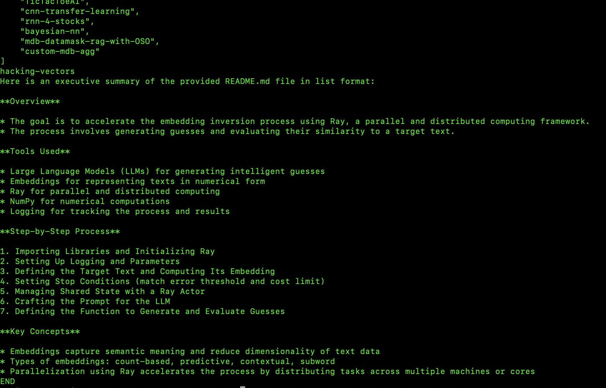

# readme-profiler



---


# Automating GitHub Repository Summaries with Python

a Python script that fetches a user's GitHub repositories within a specific date range, extracts and summarizes their `README.md` files, and compiles the summaries into a consolidated Markdown profile.


Imagine having a tool that not only fetches a user's GitHub repositories within a specific date range but also extracts and summarizes their `README.md` files. This tool would provide a quick overview of multiple repositories, making it easier to keep an eye on recent changes or understand the purpose of new repositories. This blog post introduces a Python script that does exactly that, leveraging the capabilities of OpenAI's GPT models to summarize the content.

## Introduction

Summarizing repository content can be invaluable for developers who want to keep an eye on recent changes or for anyone interested in a quick overview of multiple repositories. This Python script automates the process by:

- Fetching repositories created within a specified date range.
- Downloading their `README.md` files.
- Summarizing the content using OpenAI's GPT models.
- Compiling the summaries into a Markdown file.

## Potential Extensions

While this script focuses on summarizing `README.md` files, the possibilities for extension are vast. Here are a few ideas:

1. **Code Analysis**: The script could be extended to analyze the code within the repositories. This could involve extracting key functions or classes, identifying the most commonly used libraries, or even summarizing the functionality of the code.

2. **Repository Statistics**: The script could fetch and summarize statistics about each repository, such as the number of stars, forks, open issues, or contributors. This could provide a quick overview of the repository's popularity and activity level.

3. **User Activity Analysis**: The script could analyze the user's activity on GitHub, such as the frequency of their commits, the repositories they contribute to most often, or the times of day they are most active.

4. **Automated Updates**: The script could be set up to run on a regular schedule, providing automated updates on the repositories of interest. This could be particularly useful for managers or team leads who want to stay informed about their team's work.

5. **Integration with Other Tools**: The script could be integrated with other tools or platforms. For example, the summaries could be posted to a Slack channel, sent in an email newsletter, or incorporated into a project management tool.

## Understanding the Script

### Imports and Dependencies

```python
import requests
import json
import numpy as np
import faiss
from langchain_ollama import OllamaEmbeddings
import nltk
from nltk.tokenize import sent_tokenize, word_tokenize
from tenacity import retry, wait_random_exponential, stop_after_attempt
from datetime import datetime
import urllib.request
import urllib.error
from openai import AzureOpenAI
```

These libraries handle HTTP requests, data manipulation, text tokenization, embedding computations, and API interactions.

### Initializing the Azure OpenAI Client

```python
client = AzureOpenAI(
    api_key="YOUR_AZURE_OPENAI_API_KEY",
    api_version="2024-10-21",
    azure_endpoint="https://YOUR_AZURE_ENDPOINT.openai.azure.com"
)
```

Replace `"YOUR_AZURE_OPENAI_API_KEY"` and `"https://YOUR_AZURE_ENDPOINT.openai.azure.com"` with your actual API key and endpoint.

### Retry Mechanism for API Calls

```python
@retry(wait=wait_random_exponential(min=1, max=60), stop=stop_after_attempt(5))
def chat_completion_with_backoff(**kwargs):
    return client.chat.completions.create(**kwargs)
```

This function ensures that API calls are retried upon failure, using exponential backoff.

### Text Summarization Function

```python
def summarize_text(text, max_length=10):
    system_message = "You are a helpful assistant that summarizes text in markdown format."
    system_message += " Provide only the summary, without any additional explanations."
    user_input = f"Summarize this `README.md` text in about {max_length} words: ```README.md\n{text}```"
    response = chat_completion_with_backoff(
        model="gpt-4o",
        messages=[
            {"role": "system", "content": system_message},
            {"role": "user", "content": user_input}
        ],
    )
    return response.choices[0].message.content.strip()
```

This function leverages OpenAI's GPT models to summarize the given text.

### Fetching GitHub Repositories

```python
def get_repositories_within_date_range(username, token, start_date, end_date):
    """
    Fetches repositories created by a GitHub user within a specified date range.

    Parameters:
    - username: GitHub username as a string.
    - token: Personal Access Token with appropriate permissions.
    - start_date: Start date in 'YYYY-MM-DD' format.
    - end_date: End date in 'YYYY-MM-DD' format.

    Returns:
    - A list of repository names created within the specified date range.
    """
    repositories = []
    page = 1
    per_page = 100  # GitHub API allows up to 100 items per page

    # Validate date format
    try:
        datetime.strptime(start_date, '%Y-%m-%d')
        datetime.strptime(end_date, '%Y-%m-%d')
    except ValueError:
        raise ValueError("Dates must be in 'YYYY-MM-DD' format.")

    while True:
        query = f"user:{username} created:{start_date}..{end_date}"
        url = "https://api.github.com/search/repositories"
        headers = {
            "Accept": "application/vnd.github+json"
        }
        if token:
            headers["Authorization"] = f"Bearer {token}"
        params = {
            "q": query,
            "per_page": per_page,
            "page": page
        }
        response = requests.get(url, headers=headers, params=params)

        if response.status_code != 200:
            raise Exception(f"GitHub API returned status code {response.status_code}: {response.json().get('message', '')}")

        data = response.json()
        if 'items' not in data or not data['items']:
            break

        repositories.extend(repo['name'] for repo in data['items'])
        page += 1

        # Break if we've fetched all available results
        if page > (data['total_count'] // per_page) + 1:
            break

    return repositories
```

This function retrieves repositories created by the specified user within the given date range.

### Downloading and Processing README Files

```python
def download_readme(username, repo):
    url = "https://raw.githubusercontent.com/"+username+"/"+repo+"/main/README.md"
    try:
        with urllib.request.urlopen(url) as response:
            data = response.read().decode()
        return data
    except urllib.error.HTTPError as e:
        return "unavailable"
    except Exception as e:
        return f"An error occurred: {str(e)}"
```

Downloads the `README.md` file from the repository.

### CriticalVectors Class for Chunk Selection

```python
class CriticalVectors:
    """
    A robust class to select the most relevant chunks from a text using various strategies,
    """

    def __init__(
        self,
        chunk_size=500,
        strategy='kmeans',
        num_clusters='auto',
        embeddings_model=None,
        split_method='sentences',
        max_tokens_per_chunk=512,
        use_faiss=False
    ):
        """
        Initializes CriticalVectors.

        Parameters:
        - chunk_size (int): Size of each text chunk in characters.
        - strategy (str): Strategy to use for selecting chunks ('kmeans', 'agglomerative').
        - num_clusters (int or 'auto'): Number of clusters (used in clustering strategies). If 'auto', automatically determine the number of clusters.
        - embeddings_model: Embedding model to use. If None, uses OllamaEmbeddings with 'nomic-embed-text' model.
        - split_method (str): Method to split text ('sentences', 'paragraphs').
        - max_tokens_per_chunk (int): Maximum number of tokens per chunk when splitting.
        - use_faiss (bool): Whether to use FAISS for clustering.
        """
        # Validate chunk_size
        if not isinstance(chunk_size, int) or chunk_size <= 0:
            raise ValueError("chunk_size must be a positive integer.")
        self.chunk_size = chunk_size

        # Validate strategy
        valid_strategies = ['kmeans', 'agglomerative']
        if strategy not in valid_strategies:
            raise ValueError(f"strategy must be one of {valid_strategies}.")
        self.strategy = strategy

        # Validate num_clusters
        if num_clusters != 'auto' and (not isinstance(num_clusters, int) or num_clusters <= 0):
            raise ValueError("num_clusters must be a positive integer or 'auto'.")
        self.num_clusters = num_clusters

        # Set embeddings_model
        if embeddings_model is None:
            self.embeddings_model = OllamaEmbeddings(model="nomic-embed-text")
        else:
            self.embeddings_model = embeddings_model

        # Set splitting method and max tokens per chunk
        self.split_method = split_method
        self.max_tokens_per_chunk = max_tokens_per_chunk

        # Set FAISS usage
        self.use_faiss = use_faiss

    

    def split_text(self, text, method='sentences', max_tokens_per_chunk=512):
        """
        Splits the text into chunks based on the specified method.

        Parameters:
        - text (str): The input text to split.
        - method (str): Method to split text ('sentences', 'paragraphs').
        - max_tokens_per_chunk (int): Maximum number of tokens per chunk.

        Returns:
        - List[str]: A list of text chunks.
        """
        # Validate text
        if not isinstance(text, str) or len(text.strip()) == 0:
            raise ValueError("text must be a non-empty string.")

        if method == 'sentences':
            nltk.download('punkt', quiet=True)
            sentences = sent_tokenize(text)
            chunks = []
            current_chunk = ''
            current_tokens = 0
            for sentence in sentences:
                tokens = word_tokenize(sentence)
                num_tokens = len(tokens)
                if current_tokens + num_tokens <= max_tokens_per_chunk:
                    current_chunk += ' ' + sentence
                    current_tokens += num_tokens
                else:
                    chunks.append(current_chunk.strip())
                    current_chunk = sentence
                    current_tokens = num_tokens
            if current_chunk:
                chunks.append(current_chunk.strip())
            return chunks
        elif method == 'paragraphs':
            paragraphs = text.split('\n\n')
            chunks = []
            current_chunk = ''
            for para in paragraphs:
                if len(current_chunk) + len(para) <= self.chunk_size:
                    current_chunk += '\n\n' + para
                else:
                    chunks.append(current_chunk.strip())
                    current_chunk = para
            if current_chunk:
                chunks.append(current_chunk.strip())
            return chunks
        else:
            raise ValueError("Invalid method for splitting text.")

    def compute_embeddings(self, chunks):
        """
        Computes embeddings for each chunk.

        Parameters:
        - chunks (List[str]): List of text chunks.

        Returns:
        - np.ndarray: Embeddings of the chunks.
        """
        # Validate chunks
        if not isinstance(chunks, list) or not chunks:
            raise ValueError("chunks must be a non-empty list of strings.")

        try:
            embeddings = self.embeddings_model.embed_documents(chunks)
            embeddings = np.array(embeddings).astype('float32')  # FAISS requires float32
            return embeddings
        except Exception as e:
            raise RuntimeError(f"Error computing embeddings: {e}")

    def select_chunks(self, chunks, embeddings):
        """
        Selects the most relevant chunks based on the specified strategy.

        Parameters:
        - chunks (List[str]): List of text chunks.
        - embeddings (np.ndarray): Embeddings of the chunks.

        Returns:
        - List[str]: Selected chunks.
        """
        num_chunks = len(chunks)
        num_clusters = self.num_clusters

        # Automatically determine number of clusters if set to 'auto'
        if num_clusters == 'auto':
            num_clusters = max(1, int(np.ceil(np.sqrt(num_chunks))))
        else:
            num_clusters = min(num_clusters, num_chunks)

        if self.strategy == 'kmeans':
            return self._select_chunks_kmeans(chunks, embeddings, num_clusters)
        elif self.strategy == 'agglomerative':
            return self._select_chunks_agglomerative(chunks, embeddings, num_clusters)
        else:
            # This should not happen due to validation in __init__
            raise ValueError(f"Unknown strategy: {self.strategy}")

    def _select_chunks_kmeans(self, chunks, embeddings, num_clusters):
        """
        Selects chunks using KMeans clustering.

        Parameters:
        - chunks (List[str]): List of text chunks.
        - embeddings (np.ndarray): Embeddings of the chunks.
        - num_clusters (int): Number of clusters.

        Returns:
        - List[str]: Selected chunks.
        """
        if self.use_faiss:
            try:
                d = embeddings.shape[1]
                kmeans = faiss.Kmeans(d, num_clusters, niter=20, verbose=False)
                kmeans.train(embeddings)
                D, I = kmeans.index.search(embeddings, 1)
                labels = I.flatten()
            except Exception as e:
                raise RuntimeError(f"Error in FAISS KMeans clustering: {e}")
        else:
            try:
                from sklearn.cluster import KMeans
                kmeans = KMeans(n_clusters=num_clusters, random_state=1337)
                kmeans.fit(embeddings)
                labels = kmeans.labels_
            except Exception as e:
                raise RuntimeError(f"Error in KMeans clustering: {e}")

        # Find the closest chunk to each cluster centroid
        try:
            if self.use_faiss:
                centroids = kmeans.centroids
                index = faiss.IndexFlatL2(embeddings.shape[1])
                index.add(embeddings)
                D, closest_indices = index.search(centroids, 1)
                closest_indices = closest_indices.flatten()
            else:
                from sklearn.metrics import pairwise_distances_argmin_min
                closest_indices, _ = pairwise_distances_argmin_min(kmeans.cluster_centers_, embeddings)
            selected_chunks = [chunks[idx] for idx in closest_indices]
            return selected_chunks
        except Exception as e:
            raise RuntimeError(f"Error selecting chunks: {e}")

    def _select_chunks_agglomerative(self, chunks, embeddings, num_clusters):
        """
        Selects chunks using Agglomerative Clustering.

        Parameters:
        - chunks (List[str]): List of text chunks.
        - embeddings (np.ndarray): Embeddings of the chunks.
        - num_clusters (int): Number of clusters.

        Returns:
        - List[str]: Selected chunks.
        """
        try:
            from sklearn.cluster import AgglomerativeClustering
            clustering = AgglomerativeClustering(n_clusters=num_clusters)
            labels = clustering.fit_predict(embeddings)
        except Exception as e:
            raise RuntimeError(f"Error in Agglomerative Clustering: {e}")

        selected_indices = []
        for label in np.unique(labels):
            cluster_indices = np.where(labels == label)[0]
            cluster_embeddings = embeddings[cluster_indices]
            centroid = np.mean(cluster_embeddings, axis=0).astype('float32').reshape(1, -1)
            # Find the chunk closest to the centroid
            if self.use_faiss:
                index = faiss.IndexFlatL2(embeddings.shape[1])
                index.add(cluster_embeddings)
                D, I = index.search(centroid, 1)
                closest_index_in_cluster = I[0][0]
            else:
                from sklearn.metrics import pairwise_distances_argmin_min
                closest_index_in_cluster, _ = pairwise_distances_argmin_min(centroid, cluster_embeddings)
                closest_index_in_cluster = closest_index_in_cluster[0]
            selected_indices.append(cluster_indices[closest_index_in_cluster])

        selected_chunks = [chunks[idx] for idx in selected_indices]
        return selected_chunks

    def get_relevant_chunks(self, text):
        """
        Gets the most relevant chunks from the text.

        Parameters:
        - text (str): The input text.

        Returns:
        - List[str]: Selected chunks.
        """
        # Split the text into chunks
        chunks = self.split_text(
            text,
            method=self.split_method,
            max_tokens_per_chunk=self.max_tokens_per_chunk
        )

        if not chunks:
            return [], '', ''

        # first part
        first_part = chunks[0]
        # last part
        last_part = chunks[-1]

        # Compute embeddings for each chunk
        embeddings = self.compute_embeddings(chunks)

        # Select the most relevant chunks
        selected_chunks = self.select_chunks(chunks, embeddings)
        return selected_chunks, first_part, last_part
```

This class handles the chunking of text and selects the most relevant chunks using clustering algorithms.

### Generating the Markdown Profile

```python
markdown_readme_profile = f"""# README.md
[](https://github.com/{username})

# {username}

# Repositories

"""
```

Iterates over the repositories, summarizes their `README.md` files, and appends the summaries to the Markdown profile.

## Running the Script

1. **Set User Parameters**:

   ```python
   username = 'YOUR_GITHUB_USERNAME'
   token = 'YOUR_GITHUB_TOKEN'
   start_date = 'YYYY-MM-DD'
   end_date = 'YYYY-MM-DD'
   ```

   Replace with your GitHub username, token, and the desired date range.

2. **Execute the Script**:

   Run the script in your Python environment:

   ```bash
   python3 demo.py
   ```

3. **Output**:

   The script will generate a Markdown file with summaries of your repositories:

   ```markdown
   # README.md
   [](https://github.com/YOUR_USERNAME)

   # YOUR_USERNAME

   # Repositories

   ## [repo:repository_name](https://github.com/YOUR_USERNAME/repository_name)

   Summary of the repository's README.

   ```
